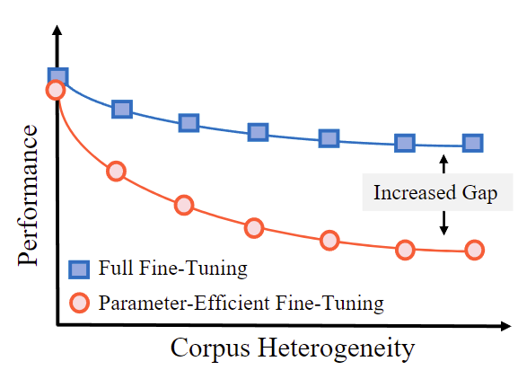
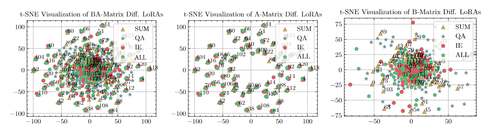
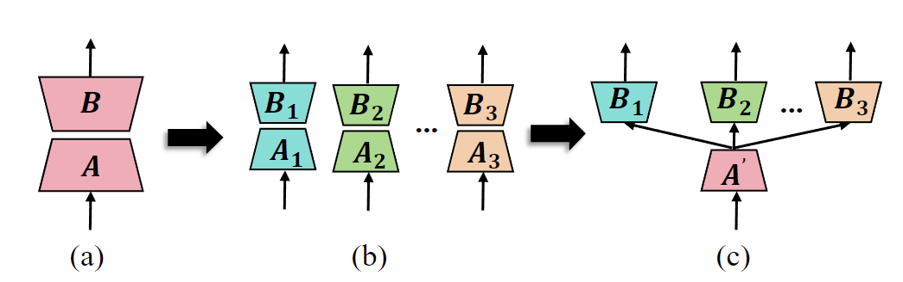

# HydraLoRA: An Asymmetric LoRA Architecture for Efficient Fine-Tuning
This repo contains the source code of HydraLoRA.

## Highlights

Fine-tuning a small subset of parameters offers a streamlined approach for domain adaptation, it’s well-recognized that model performance is closely tied to the number of parameters involved.
This intrinsic characteristic of methods like LoRA often results in them falling short of the FFT baseline, which updates all parameters, thereby creating a trade-off between efficiency and model quality. 

<figure style="text-align:center">
  
</figure>
The figure demostrates erformance impact of corpus heterogeneity on full fine-tuning vs. parameter-efficient fine-tuning. Heterogeneity signifies the diversity within the dataset, often leading to intereference due to its varied content and style. Parameter-efficient approaches are particularly sensitive, suffering greater performance losses in heterogeneous cases.


This issue of compromised quality in a low-parameter setting becomes even more pronounced in target domains characterized by complex sub-domains and diverse tasks. This situation presents a compelling research question:

**What is the optimal architecture that can deliver superior model performance while still capitalizing on the efficiency benefits of a reduced parameter footprint?**


<figure style="text-align:center">
  
</figure>
Breakdown analysis of LoRA modules.Consider LLaMA2-7b (random seed=42), which contains 32 decoder layers, corresponding to 32 adaptive modules. Each module consists of **0: q_proj_A, 1: q_proj_B, 2: v_proj_A, 3: v_proj_B** submodules. This makes a total of 32 X 4 submodules. (a,b) left displays all submodules. (a,b) center shows all even submodules, i.e. the A matrix. (a,b) right represents all odd submodules, i.e. the B matrix. It can be seen that the differences in the fine-tuned LoRA modules for different tasks arise mainly from the B matrix.

<figure style="text-align:center">
  
</figure>

llustration of LoRA architecture changes in HydraLoRA. Only the tunable parameters
are shown in this Figure. (a) LoRA architecture with matrix A to achieve low rank and matrix B to recover. (b) under the same parameter count, a monolithic LoRA is splitted into multiple smaller A and B matrices to avoid training interference. (c) based on (b), HydraLoRA has an asymmetric structure that has a shared A matrix and multiple B matrices.

##  Install
**1. Clone this repository**: 
```
git clone git@github.com:Clin0212/HydraLoRA.git
cd HydraLoRA file
```

**2. Implementation Environment**: The model is implemented by using Pytorch. Using this command to implement your environment.

```
conda env create -f environment.yml
```


## Project Structure
The source code is organized as below:

``` shell
|-- Motivation
    -- lora_breakdown.py # Analyzing the Lora modules
|-- HydraLoRA
    -- moe.py # code for MoE
    -- lora_init.py # using k-means to init hydralora
    -- lora_training.py # main code for hydralora learning 
    -- lora_inrerence.py # main code for hydralora  inference
    -- constant.py # lora candidate module names
|-- Eval # usage code for evaluation
    -- mmlu.py
    -- mmlu_medical.py
    -- mmlu_law.py
    -- GSM8k.py
    -- Humaneval.py
```

## Quickstart
**1. lora analysis**: 

```
python  motivation/lora_breakdown.py
```
**2. hydralora training**: 

```
python  hydralora/fine-tuning.py \
    --stage sft \
    --model_name_or_path path_model \
    --do_train \
    --dataset dataset_name \
    --template default \
    --finetuning_type lora \
    --lora_target q_proj,v_proj \
    --output_dir checkpoint_path \
    --overwrite_cache \
    --per_device_train_batch_size 4 \
    --gradient_accumulation_steps 4 \
    --lr_scheduler_type cosine \
    --logging_steps 10 \
    --save_steps 1000 \
    --learning_rate 5e-5 \
    --num_train_epochs 3.0 \
    --plot_loss \
    --fp16
```

**3. hydralora inference**: 

'''
python hydralora/inference.py \
    --model_name_or_path path_model \
    --adapter_name_or_path  adapter_path\
    --template vanilla \
    --finetuning_type lora \
    --task eval_task_name \
    --split test \
    --lang en \
    --n_shot 0 \
    --batch_size 4
'''

## Citation
If our work is useful for you, please consider citing our paper:
```
@misc{xxx
}
```