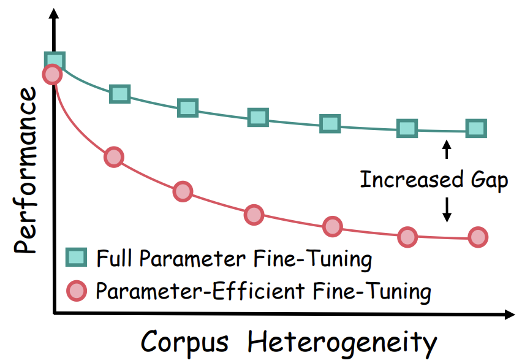

# [NeurIPS'24 Oral] HydraLoRA: An Asymmetric LoRA Architecture for Efficient Fine-Tuning
This repo contains the source code of [HydraLoRA](https://arxiv.org/abs/2404.19245). 

Discover the power of Asymmetric LoRA—achieving superb performance with significantly fewer parameters! 🌟 HydraLoRA features an asymmetric fine-tuning architecture capable of effectively identifying and adapting to the "intrinsic components" within the data—sub-domains or diverse tasks that may be challenging for domain experts to explicitly delineate.

<figure style="text-align:center">
  
</figure>

**Figure 1**: llustration of LoRA architecture changes in HydraLoRA. Only the tunable parameters
are shown in this Figure. (a) LoRA architecture with matrix A to achieve low rank and matrix B to recover. (b) under the same parameter count, a monolithic LoRA is splitted into multiple smaller A and B matrices to avoid training interference. (c) based on (b), HydraLoRA has an asymmetric structure that has a shared A matrix and multiple B matrices.

## 🚀 Updates
- 2024/12/01 ---  Added [MLLM_HydraLoRA](MLLM-HydraLoRA/README.md) version for Multimodal Large Language Model (Llava).

## 🔥 Motivation and Observation

### LoRA’s Practical Dilemma

Fine-tuning a small subset of parameters offers a streamlined approach for domain adaptation, it’s well-recognized that model performance is closely tied to the number of parameters involved. This intrinsic characteristic of methods like LoRA often results in them falling short of the FFT baseline, which updates all parameters, thereby creating a trade-off between efficiency and model quality. 

This issue of compromised quality in a low-parameter setting becomes even more pronounced in target domains characterized by complex sub-domains and diverse tasks. This situation presents a compelling research question:

**What is the optimal architecture that can deliver superior model performance while still capitalizing on the efficiency benefits of a reduced parameter footprint?**

<figure style="text-align:center">
  
</figure>

**Figure 2**: The figure demostrates erformance impact of corpus heterogeneity on full fine-tuning vs. parameter-efficient fine-tuning. Heterogeneity signifies the diversity within the dataset, often leading to intereference due to its varied content and style. Parameter-efficient approaches are particularly sensitive, suffering greater performance losses in heterogeneous cases.

###  LoRA's Asymmetry

When multiple LoRA heads are trained individually on different data, the parameters of matrix A from different heads tend to converge, while those of matrix B are distinguishable.

<figure style="text-align:center">
  
</figure>

**Figure 3**: Breakdown analysis of LoRA modules. Consider LLaMA2-7B (random seed=42), which contains 32 decoder layers, corresponding to 32 adaptive modules. Each module consists of 0: q_proj_A, 1: q_proj_B, 2: v_proj_A, 3: v_proj_B submodules. This makes a total of 32 X 4 submodules. (a,b) left displays all submodules. (a,b) center shows all even submodules, i.e. the A matrix. (a,b) right represents all odd submodules, i.e. the B matrix. It can be seen that the differences in the fine-tuned LoRA modules for different tasks arise mainly from the B matrix.

## Workflow of HydraLoRA
<figure style="text-align:center">
  
</figure>

**Figure 4**: Architecture and workflow of HydraLoRA. During the fine-tuning stage, HydraLoRA first adaptively identifies and initializes N of intrinsic components without specific domain knowledge. It then employs a trainable MoE router that treats each intrinsic component as an expert to automatically segregate training samples
into intrinsic components for fine-tuning. During the inference stage, HydraLoRA merges multiple B matrices flexibly and dynamically through a trained router.

**⚠️ Note:** 

1. MoE is not the core contribution of this paper; it is used here merely as a module fusion tool, and other fusion methods could also be considered.
2. K-means is used merely as a tool to determine the number N of B modules. Alternatively, N can be manually specified or derived using other methods, such as DBSCAN discussed in this paper.

**For more details please check out our paper.**

## 🛠️ Install

**Implementation Environment**: The model is implemented by using Pytorch. Using this command to implement your environment.

```
conda create -n hydralora python=3.10
conda activate hydralora
pip install -r requirements.txt
```
or
```
conda env create -f environment.yml
```

**Dataset**: [Link](https://github.com/Clin0212/HydraLoRA/issues/1) Please note that the asymmetric structure of HydraLoRA is not limited to the datasets listed. You're welcome to use other datasets to explore its robustness.

## 🛠️ Project Structure
The source code is organized as below:

``` shell
|-- Motivation
    -- tesn_lora.py # analyzing the Lora modules
|-- HydraLoRA
    -- peft
    -- fine-tuning.py # main code for hydralora learning
```

## 🕹️ Quickstart
### **1. LoRA analysis**: 

```
bash motivation/tesn_lora.sh
```

### **2. HydraLoRA training**: 

**Single-GPU**

```
bash HydraLoRA/fine-tuning.sh
```

**DeepSpeed**

```
bash HydraLoRA/fine-tuning_dp.sh
```

### **3. Evaluate:**

Use [opencompass](https://github.com/open-compass/opencompass/tree/main) for evaluation. 

In `opencompass/opencompass/models/huggingface.py`, add:

```
import sys
sys.path.insert(0, 'path_to_your_current_dir_containing_changed_peft&transformers')
```
In the config file `opencompass/configs/models/hf_llama/hf_llama2_7b.py`:

```
models = [
    dict(
        type=HuggingFaceCausalLM,
        abbr='llama-2-7b-hf',
        path="path_to_base_model",
        tokenizer_path='path_to_tokenizer',
        peft_path='path_to_hydralora',
        ...
    )
]
```


For zero-shot, `opencompass/configs/datasets/mmlu/mmlu_ppl_ac766d.py` (line 89)

 ```
 retriever=dict(type=ZeroRetriever)
 ```


## ⭐ Citation

If you find our work helpful, please consider citing our paper:
```
@inproceedings{tian2024hydralora,
  title={HydraLoRA: An Asymmetric LoRA Architecture for Efficient Fine-Tuning},
  author={Tian, Chunlin and Shi, Zhan and Guo, Zhijiang and Li, Li and Xu, Chengzhong},
  booktitle={Advances in Neural Information Processing Systems (NeurIPS)},
  year={2024}
}
```

## ❤️ References

The code refers to the repo [LoRAMoE](https://github.com/Ablustrund/LoRAMoE), [parameter-efficient-moe
](https://github.com/for-ai/parameter-efficient-moe), [LLaMA-Factory](https://github.com/hiyouga/LLaMA-Factory), [opencompass](https://github.com/open-compass/opencompass/tree/main).
